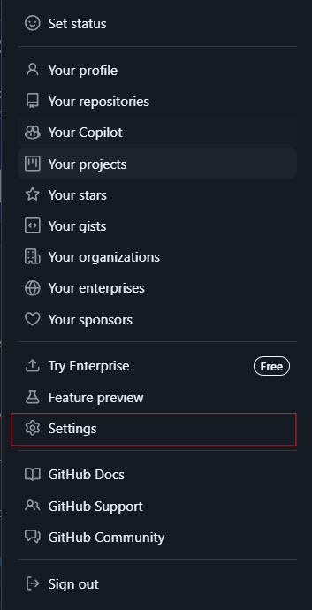
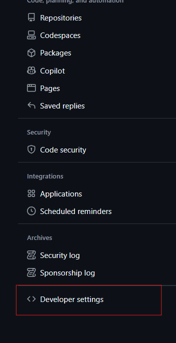
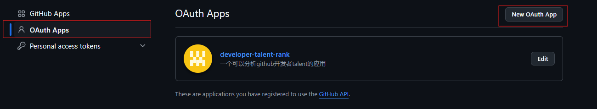
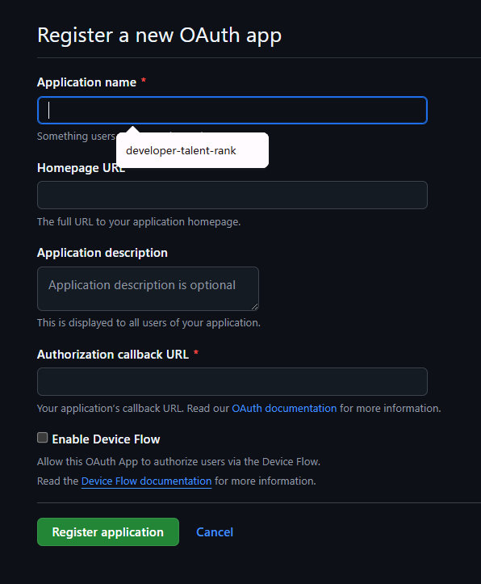
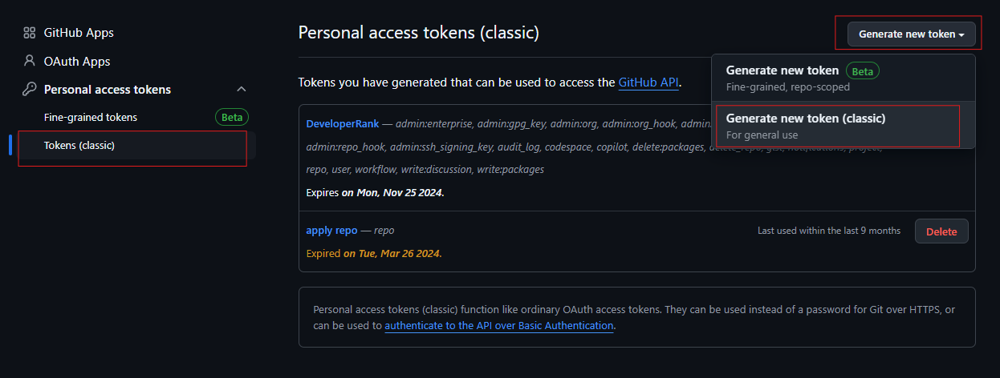
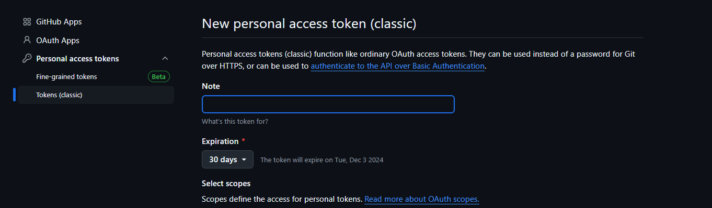

# Developer talent rank - 一个 github 账户衡量工具

一个开源的 github 账户评级工具。通过使用 github 官方 api 接口爬取数据以及开发者提供给的公开账户，并对这些数据进行 ai 分析，得到对这个开发者的技能描述以及所在国家。

<p></p>
<a href="https://o5xs51q9oa.feishu.cn/wiki/VYX1wl6SxiffRKkImd7cHYo4n6b?from=from_copylink">Docs</a> •
<a href="https://yjxx.oss-cn-nanjing.aliyuncs.com/img/202411061118608.mp4">Live Demo</a>

## 主要功能

- **Github 一键登录** ✍️: 支持 Github 用户一键登录，并可以查看自己的分数信息。
- **查询用户分数** 🏠: 通过 github api 查询到对应用户名数据，并对其分析，返回图文结果。
- **国家地区推测** 🤲: 通过开发者公开的关系网络，使用聚类算法，估计开发者国家地区。
- **AI 分析** 🧩: 爬取开发者公开信息，使用 DeepSeek 大模型平台，评估这个开发者技能水平。

## 项目技术架构

### 后端架构

| 技术                  | 描述                                             |
| --------------------- | ------------------------------------------------ |
| **Java 8**            | 使用 Java 8 作为主要编程语言                     |
| **Spring Boot 2.7.2** | 基于 Spring 框架的快速开发框架                   |
| **MyBatis Plus**      | 简化 MyBatis 的 ORM 框架                         |
| **Redis**             | 用于缓存用户登录信息和存储 GitHub OAuth 登录信息 |
| **RabbitMQ**          | 消息队列，支持异步处理和微服务架构               |
| **Hutool**            | 提供常用工具类，简化开发工作                     |
| **MySQL**             | 数据库管理系统，存储应用数据                     |
| **Knife4j**           | 基于 Swagger 的 API 文档生成工具                 |
| **OpenAPI**           | 描述和文档化 RESTful API 的标准                  |
| **Commons Lang 3**    | 提供增强 Java 标准库的工具类                     |
| **Lombok**            | 简化 Java 代码，减少样板代码                     |
| **Redisson**          | Redis 客户端，提供分布式数据结构和工具           |
| **Jsoup**             | 用于解析和操作 HTML 文档的 Java 库               |

### 前端架构

| 技术               | 描述                                       |
| ------------------ | ------------------------------------------ |
| **Ant Design Pro** | 基于 Ant Design 的企业级中后台前端解决方案 |
| **Pro Components** | Ant Design Pro 提供的高阶组件              |
| **Ant Design**     | 设计优雅的 React UI 组件库                 |
| **Umi**            | 企业级前端框架，提供路由和状态管理功能     |
| **Yarn**           | JavaScript 包管理工具，快速管理依赖        |

## 在本地搭建项目

### 申请 Github oauth

申请的过程官方文档的版本比较早期，所以不建议看官方文档，但是其中的 api 接口应当选择官方文档

1. 进入 Settings 界面
   
2. 选择 Developer settings 选项
   
3. 选择到 OAuth Apps 目录中，点击 New OAuth App
   
4. 填写项目描述
   
   其中 Authorization callback URL 表示当授权登录之后跳转回来的页面

### 开通 Github token

同样到 Developer settings 选项

1. 选择到 Personal access tokens 下的 Tokens (classic) 选项下，点击按钮 Generate new token，以及 Generate new token (classic)
   
2. 填写信息，然后保存 token
   

### 配置项目

需要配置的中间件以及数据库

- MySQL，直接执行 sql/create_table.sql 即可
- redis
- rabbitmq

### 后端手动启动

使用 maven 构建项目

```shell
mvn clean package
```

使用 java8 启动项目

```shell
cd .\target\
java -jar developer-talent-rank-0.0.1-SNAPSHOT.jar
```

### 前端手动启动

进入到 web 目录

```shell
cd web
```

使用 node、yarn、pnpm 等包管理工具下载依赖，这里用 yarn 做演示

```shell
yarn install
```

启动项目

```shell
yarn run start
```
